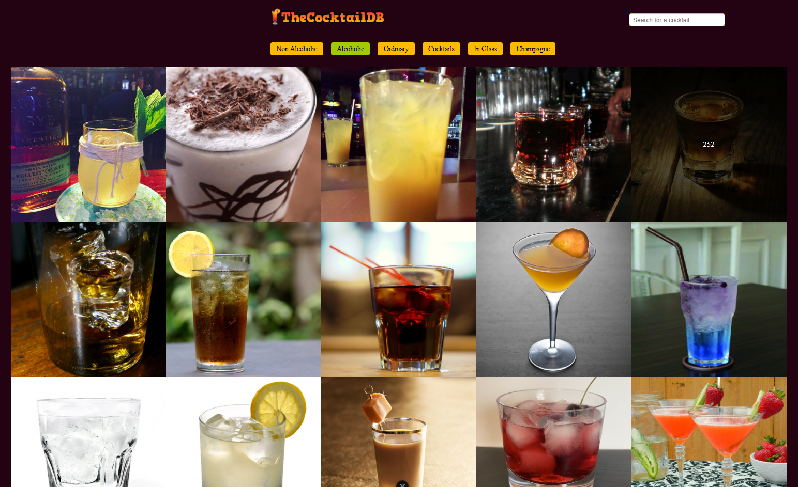

# Vue 3 Resource shows different cocktails

  

This app works with API TheCocktailBD: 'https://www.thecocktaildb.com/'

  
- Get API data and show it
- Ability to sort by category and alphabet
- Searchable by title

  



  

---

  

## Project Setup

  

```sh

npm install

```

  

### Compile and Hot-Reload for Development

  

```sh

npm run dev

```

  

### Compile and Minify for Production

  

```sh

npm run build

```